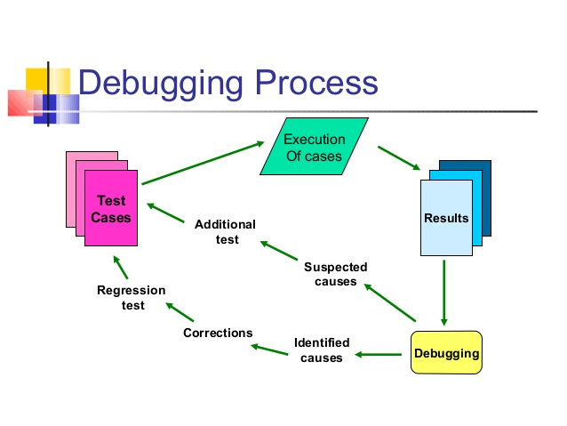

# Debugging with GDB

_"Debugging is twice as hard as writing the code in the first place. Therefore, if you write the code as cleverly as possible, you are, by definition, not smart enough to debug it."_ - **Brain W. Kernighan**

## **Motivation**

Debugging is the process of finding and resolving bugs. Debugging tactics can involve interactive debugging, control flow analysis, unit testing, integration testing, log file analysis, monitoring at the application or system level, memory dumps, and profiling. Many programming languages and software development tools also offer programs to aid in debugging, known as debuggers.

## **Debugging methods**

* Print/Trace debugging - watching the flow of execution after adding print statements to the original code (bad but quick)
* Remote debugging - connect to a remote system with a debugger, monitor the execution and state
* Post Mortem debugging - analysis of a memory dump from a program that has crashed
* Profiling - not debugging per se, but a useful technique for analysing a running program to look for issues.

### **Types of bugs**

* *Bohrbug* - bug that manifests itself consistently under a set of conditions
* *Heisenbug* - bug that alters its' characteristics when studied

## **Debugging steps**

1. Construct a Hypothesis
2. Construct an Experiment
3. Hypothesis proved? Go to step 1.
4. Need more evidence? Got to step 2.

## **GDB**

The GNU Debugger (GDB) is a portable debugger that runs on many Unix-like systems and works for many programming languages, including Ada, C, C++, Objective-C, Free Pascal, Fortran, Go, and partially others.

### **GDB with Bazel**

In order to compile code into an executable readable by `gdb` it needs to be compiled without optimization (`-O0`) and in debug mode (`-c=dbg`).
For additional debugging information, available only to gdb, use flag `-ggdb`.

`--copt=-O0` `--copt=-ggdb` `-c=dbg`

Example: `bazel build --copt=-O0 --copt=-ggdb -c=dbg //...`

### **rr**

**rr** aspires to be your primary C/C++ debugging tool for Linux, replacing — well, enhancing — gdb. You record a failure once, then debug the recording, deterministically, as many times as you want. The same execution is replayed every time.

Usage:
[rr usage examples](https://github.com/mozilla/rr/wiki/Usage)

## **Command line arguments**

1. `gdb` <*executable built with no optimization and in debug mode*>
2. If you're debugging an executable throwing (ex. core dumping) you can use: `catch signal all`
3. Moving around: `b` *source.cpp* - set breakpoint, `r` - run, `n` - next, `c` - continue, `p` *variable* - observe
4. `tui enable` / `tui disable` - GUI

[**gdb** cheatsheet](http://www.yolinux.com/TUTORIALS/GDB-Commands.html)

## **Compile errors**

For isolating compiler errors more easily:

* `bazel build //... 2>&1 | grep -ie error\: -C3`
