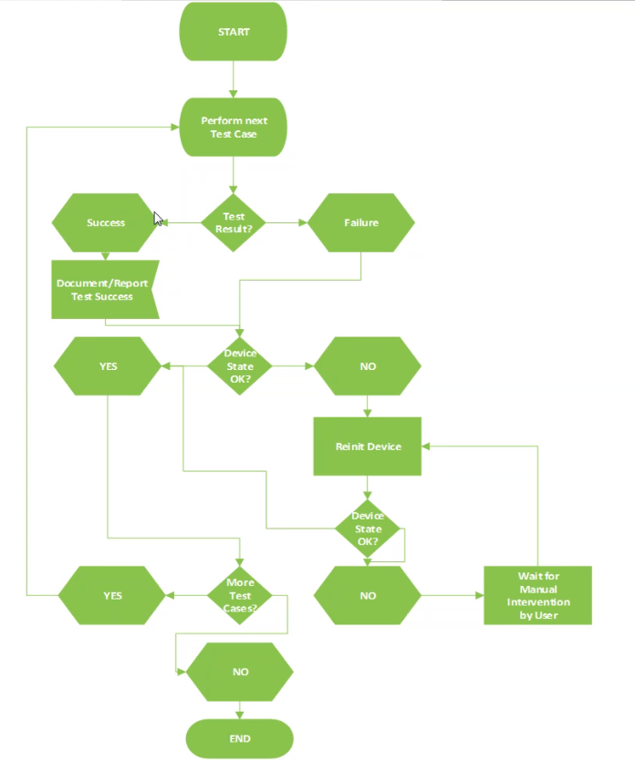
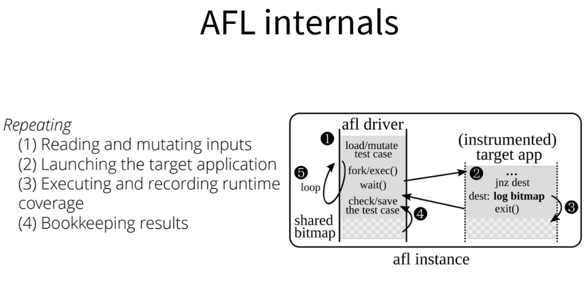
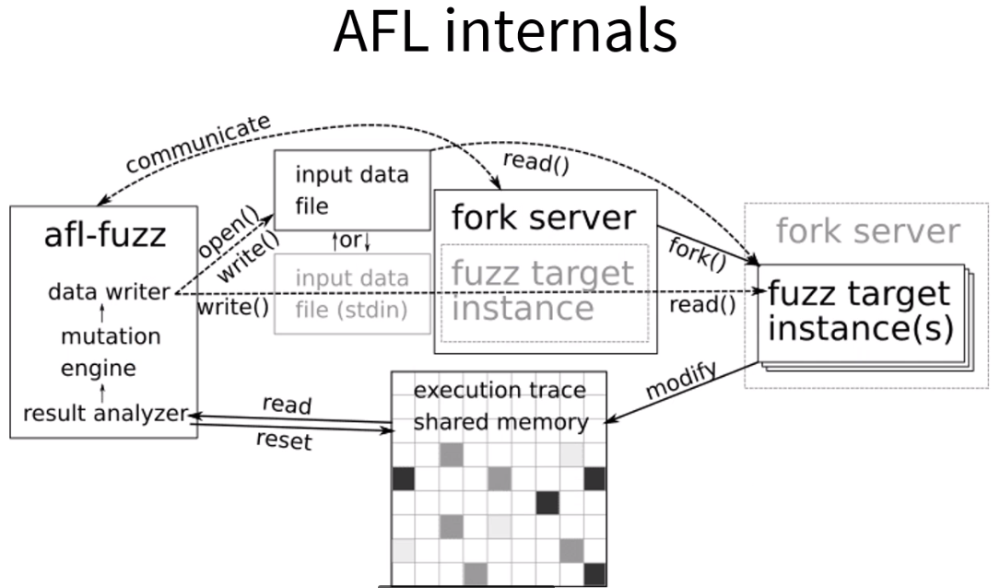

# Fuzzy testing

**A full software security analysis consists on**:

1. Fuzzing
2. Pen-testing
3. Source code review
4. Binary disassembling

## **What is _Fuzzing_**

- Fuzzing represents an automated technique to discover bugs in software by sending faulty data to the application
- The faulty data is usually based on variations of valid data

## **Fuzzing**

- Requires interface access to whatever you are fuzzing
- Helpful to know what is the protocol description
- Advantage - fast to perform (setup)
- Disadvantage - limited coverage and test scope

### **When to perform fuzzing**

- Used for input validation
- Fast to write and deploy
- Get the low hanging fruits
- Depending on fuzzing mechanism it can result in many false positives

### **What to fuzz**

- Network APIs
- Application interfaces / input channels (stdin, signals, environment variables, input files, IPC, ...)
- APIs, system calls, library calls
- _Everything that let us interact in any way and let us observe their state_

### **The fuzzing quality triangle**

```cpp
           Speed
           /    \
          /      \
         /  bugs  \
        /          \
Test Cases-------Code Coverage
```

### **Fuzzing types 1**

1. Whitebox: API access + source code access
2. Greybox: API access + system/binary access
3. Blackbox: API access only

### **Fuzzing types 2**

1. Dumb - just random variations
2. Smart - know the content and update CRCs, length fields, etc.
3. Format - know the whole format and work with it

### **Analyze the data format**

- What byte/bit/integer means what?
- Opportunities and Issues:
  - Length fields
  - Strings
- Problems areas:
  - Encodings (hex, base64, UTF8, UTF16, UTF32)
  - Cryptographic signatures
  - Checksums

### **Meta layers**

A SOME/IP packet that contains XML text has the following layers that all need to be fuzzed:

- SOME/IP header data (head data)
- SOME/IP content structure (length of strings)
- SOME/IP content data (content of strings)
- SOME/IP meta content data (how are the strings interpreted at later processing steps)

### **Showstoppers**

- Checksums & cryptographic signatures
  - Comment them out of the code
  - Patch them out of the binary
  - Fixup function in the fuzzed that calculated the correct value and writes it into the input

### **Fuzzing steps**



## **Two main fuzzing areas**

1. Coverage guided random fuzzing (usually based on source code [whitebox/greybox])
2. Hammering and interface with a fuzzer tool which sends specific values (blackbox)

### **1. Coverage guided**

- Very good code coverage
- Best method to find buffer overflow bugs (e.g. memcpy-length, strcpy, double free, use after free, NULL pointer dereference, integer overflows, type confusion, etc.)
- Possible <=> hard to find race conditions and logical bugs
- Unable to find: meta bugs (e.g injection vulnerabilities), missing authorization checks, crypto issues

### **2. Black box approach**

- Usually unknown code coverage
- Good to find meta bugs (e.g. injection vulnerabilities) and buffer overflow bugs
- Hard to find race conditions and logical bugs
- Unable to find missing authorization checks, crypto issues, etc

### **Choose your tools and goals wisely**

- Some issues are best to find with source code inspections (missing authorization, crypto issues)
- Some by hands-on pen-testers (missing authorization, logical bugs, meta bugs)
- Some by coverage guided source-based fuzzing (everything buffer overflow)
- Some by blackbox protocol fuzzing (meta bugs)

## **AFL++ source code coverage fuzzer**

### **AFL workflow**

1. Randomly selects an input and change something in ti randomly
2. Run the target program with the input
   - Did it crash? Save the input as crash case
   - Did the input use a path never seen before? Put the input in the input seed list
3. Go to step 1

### **AFL internals**

1. Coverage information is made available to AFL via share memory
2. Coverage information is gathered by instrumenting each branch




### **AFL good & bad**

1. **Good**: Very easy to use and deploy
2. **Good**: You need not to know anything about the input data
3. **Bad**: By default it can only work on input files and stdin
4. **Bad**: Possible but harder to use on library APIs rather than programs

### **AFL++**

1. AFL is not supported anymore - AFL++ is now community supported
2. Best fuzzer currently (<url>http://commondatastorage.googleapis.com/fuzzbench-reports/oss-fuzz-benchmarks/index.html</url>)
3. AFL++ is very easy to use

### **Things good to know about AFL**

Parallel fuzzing! (Up to $(nproc) instances)
- Master fuzz process
- ...

### **Better AFL performance

- /etc/default/grub:
  - Disable all mitigations (spectre)
- Before running AFL after a reboot:
  - afl-system-config (otherwise AFL won't run!)

## **Libfuzzer source code coverage fuzzer**

- Fuzzing libraries and functions
- Triggered by the Google Chrome team a few months after AFL was released and seen to be very successful
- Now incorporated in llvm since 6.0
- Specifically  desined to test functions and library calls

### **Libfuzzer workflow**

1. Include the *libfoo.h* library

```cpp
#include <std.h>
#include <stddef.h>
#include <libfoo.h>
...
```

## **Structure-aware fuzzing**

...

## **How to fuzz complex targets**

...

## **How to run fuzzing campaigns**

- Libfuzzer can be run with input arguments:
  <code>./fuzz output_dir/ input_dir/</code>

### **Libfuzzer good & bad**

1. **Good**: fast
2. **Good**: for developers
3. **Bad**: ...
...
