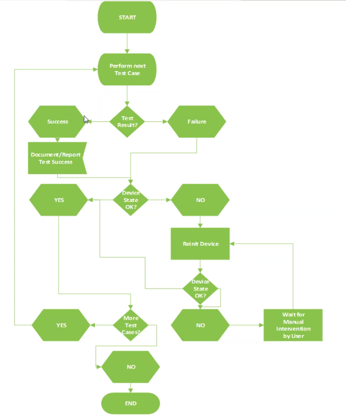
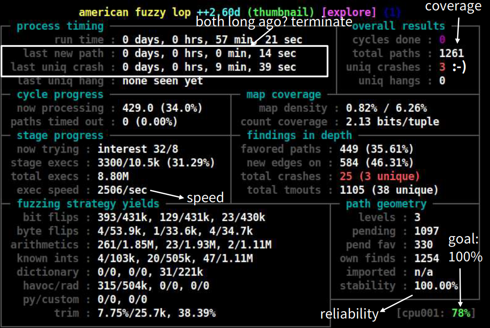
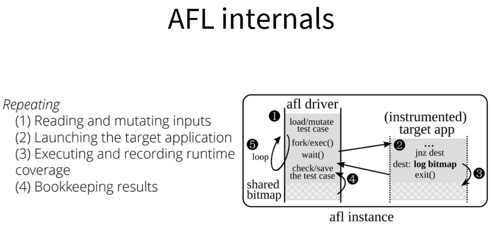
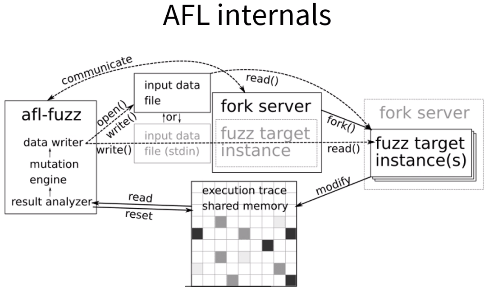

# Fuzzy testing

**A full software security analysis consists on**:

1. Fuzzing
2. Pen-testing
3. Source code review
4. Binary disassembling

## **What is _Fuzzing_**

- Fuzzing represents an automated technique to discover bugs in software by sending faulty data to the application
- The faulty data is usually based on variations of valid data

## **Fuzzing**

- Requires interface access to whatever you are fuzzing
- Helpful to know what is the protocol description
- Advantage - fast to perform (setup)
- Disadvantage - limited coverage and test scope

### **When to perform fuzzing**

- Used for input validation
- Fast to write and deploy
- Get the low hanging fruits
- Depending on fuzzing mechanism it can result in many false positives

### **What to fuzz**

- Network APIs
- Application interfaces / input channels (stdin, signals, environment variables, input files, IPC, ...)
- APIs, system calls, library calls
- _Everything that let us interact in any way and let us observe their state_

### **The fuzzing quality triangle**

```bash
           Speed
           /    \
          /      \
         /  bugs  \
        /          \
Test Cases-------Code Coverage
```

### **Fuzzing types 1**

1. Whitebox: API access + source code access
2. Greybox: API access + system/binary access
3. Blackbox: API access only

### **Fuzzing types 2**

1. Dumb - just random variations
2. Smart - know the content and update CRCs, length fields, etc.
3. Format - know the whole format and work with it

### **Analyze the data format**

- What byte/bit/integer means what?
- Opportunities and Issues:
  - Length fields
  - Strings
- Problems areas:
  - Encodings (hex, base64, UTF8, UTF16, UTF32)
  - Cryptographic signatures
  - Checksums

### **Meta layers**

A SOME/IP packet that contains XML text has the following layers that all need to be fuzzed:

- SOME/IP header data (head data)
- SOME/IP content structure (length of strings)
- SOME/IP content data (content of strings)
- SOME/IP meta content data (how are the strings interpreted at later processing steps)

### **Showstoppers**

- Checksums & cryptographic signatures
  - Comment them out of the code
  - Patch them out of the binary
  - Fixup function in the fuzzed that calculated the correct value and writes it into the input

### **Fuzzing steps**



## **Two main fuzzing areas**

1. Coverage guided random fuzzing (usually based on source code [whitebox/greybox])
2. Hammering and interface with a fuzzer tool which sends specific values (blackbox)

*The result is very different, even if they fuzz the same thing!*

### **1. Coverage guided**

- Very good code coverage
- Best method to find buffer overflow bugs (e.g. memcpy-length, strcpy, double free, use after free, NULL pointer dereference, integer overflows, type confusion, etc.)
- Possible <=> hard to find race conditions and logical bugs
- Unable to find: meta bugs (e.g injection vulnerabilities), missing authorization checks, crypto issues

### **2. Black box approach**

- Usually unknown code coverage
- Good to find meta bugs (e.g. injection vulnerabilities) and buffer overflow bugs
- Hard to find race conditions and logical bugs
- Unable to find missing authorization checks, crypto issues, etc

### **Choose your tools and goals wisely**

- Some issues are best to find with source code inspections (missing authorization, crypto issues)
- Some by hands-on pen-testers (missing authorization, logical bugs, meta bugs)
- Some by coverage guided source-based fuzzing (everything buffer overflow)
- Some by blackbox protocol fuzzing (meta bugs)

## **AFL++ source code coverage fuzzer**



### **AFL workflow**

1. Randomly selects an input and change something in ti randomly
2. Run the target program with the input
   - Did it crash? Save the input as crash case
   - Did the input use a path never seen before? Put the input in the input seed list
3. Go to step 1

### **AFL internals**

1. Coverage information is made available to AFL via share memory
2. Coverage information is gathered by instrumenting each branch





### **AFL good & bad**

1. **Good**: Very easy to use and deploy
2. **Good**: You need not to know anything about the input data
3. **Bad**: By default it can only work on input files and stdin
4. **Bad**: Possible but harder to use on library APIs rather than programs

### **AFL++**

1. AFL is not supported anymore - AFL++ is now community supported
2. Best fuzzer currently ()
3. AFL++ is very easy to use

### **Things good to know about AFL**

Parallel fuzzing! (Up to `$(nproc)` instances)

- Master fuzz process:

```bash
afl-fuzz -M fuzzer0 ...
```

- Child fuzz processes (nproc - 1):

```bash
afl-fuzz -S fuzzer1 ...
afl-fuzz -S fuzzer2 ...
```

### **Better AFL performance**

- /etc/default/grub: Disable all mitigation (spectre):

```bash
GRUB_CMDLINE_LINUX_DEFAULT="quiet ibpb=off ibrs=off
kpti=off l1tf=off mds=off mitigations=off no_stf_barrier
noibpb noibrs nopcid nopti nospec_store_bypass_disable
nospectre_v1 nospectre_v2 pcid=off pti=off
spec_store_bypass_disable=off spectre_v2=off
stf_barrier=off"
```

- Before running AFL after a reboot (otherwise AFL won't run!):

```bash
afl-system-config
```

## **Hands-on - COMPILE YOURSELF**

Preparation:

```bash
$ apt install libtool libtool-bin python libboost-all-dev pixman autoconf automake cmake build-essential clang-9 libclang-common-9-dev protobuf-compiler libprotobuf-dev ninja-build pkg-config
$ git clone https://github.com/AFLplusplus/AFLplusplus
$ cd AFLplusplus; make source-only
$ sudo make install
```

Get AFL++:

```bash
git clone https://github.com/AFLplusplus/AFLplusplus
```

Compile and install:

```bash
export LLVM_CONFIG=llvm-config-VERSION
cd AFLplusplus
make source-only
sudo make install
```

## **Hands-on - DOCKER**

Get the AFL++ docker container:

```bash
docker pull aflplusplus/aflplusplus
```

Run the container (and add a –v /src:/dst exchange directory!)

```bash
docker run -ti -v /tmp:/share aflplusplus/aflplusplus
```

### **Targets**

- [libtiff](http://download.osgeo.org/libtiff/tiff-4.0.4.zip)
- [libjpeg](https://sourceforge.net/projects/libjpeg/files/libjpeg/6b/jpegsrc.v6b.tar.gz/download)
- [libjpeg-turbo](https://sourceforge.net/projects/libjpeg-turbo/files/1.3.1/libjpeg-turbo-1.3.1.tar.gz/download)

*Or choose your own.*

### **Let’s try it out**

- Download an old version of libjpeg, libtiff, libpng, libarchive, libsndfile, etc.
- `cd libTARGET-VERSION`
- `CC=afl-clang-fast CXX=afl-clang-fast++ ./configure --disable-shared`
- `make`
- Run AFL
  - `mkdir in`
  - `cp ~/INPUT_FILES/* in/`
  - `sudo afl-system-config afl-fuzz -i in -o out - ./TARGET @@`

_This can take a long time. **Always check first that your command line with the test input file works well!**_

### **Better performances**

AFL llvm_mode has options for better path discovery and solving:

- `export AFL_LLVM_LAF_SPLIT_SWITCHES=1`
- `exportAFL_LLVM_LAF_SPLIT_FLOATS=1`
- `export AFL_LLVM_LAF_SPLIT_COMPARES=1`
- `export AFL_LLVM_LAF_TRANSFORM_COMPARES=1`
- `export AFL_LLVM_INSTRUMENT_LIST=filelist.txt`

### **What do we do with the crashes?**

- Test cases that crashed the target are in ./out/crashes/
- Trace the program with that crash input file. If necessary, recompile with debug

`ulimit -c unlimited./PROGRAM out/crashes/id:0...gdb ./PROGRAM core`

### **Showstoppers - hands on**

Checksums, HMAC checks etc. -fuzzers have difficulties handling that. Solutions:

- Use a postprocess function library, see AFL_CUSTOM_MUTATOR_LIBRARY and experimental/custom_mutators/*.c
- Disable in the source code:

```cpp
#ifdef FUZZING_BUILD_MODE_UNSAFE_FOR_PRODUCTION
  return 0;
#endif
  if (check_hmac(input, hmac) != 0)
    return -1;
```

### **How to make it better**

Use the newest LLVM you can (llvm_modesupports  3.3 -11)

`CC=afl-clang-fast CXX=afl-clang-fast++`

### **How long to run AFL? Coverage**

A week is a good standard, but complex input should run up to a month and longer.
With smaller input sizes symbolic execution based fuzzers are a good addition (e.g. Angora, QSym).

- If the fuzzer ran an hour, a day, a week ... what coverage was achieved?
- Maybe important parts were not reached?
- We need a way to assess what afl could cover!

### **afl-cov**

We use gcc's `gcov` feature for this, and afl-cov is a great wrapper around this:

`git clone https://github.com/vanhauser-thc/afl-cov`

Now we need to install what we need additionally:

`sudo apt install gcc lcov python-subprocess32`

We need to compile the target again with coverage information:

- `cp-r TARGET TARGET-cov`
- `cd TARGET-cov`
- `make clean`
- `/afl-cov/afl-cov-build.sh ./configure --disable-shared`
- `make`

During the fuzzing we can generate statistics (from the TARGET-cov directory):

`/afl-cov/afl-cov.sh ../target/out/"./target @@"`

Afterwards open the generated index.html file :-)
